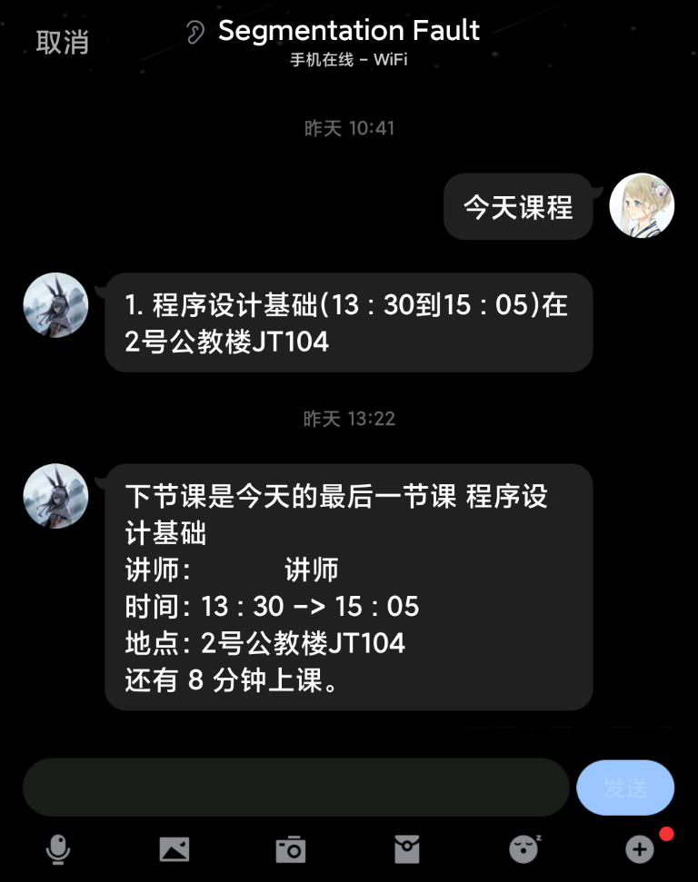
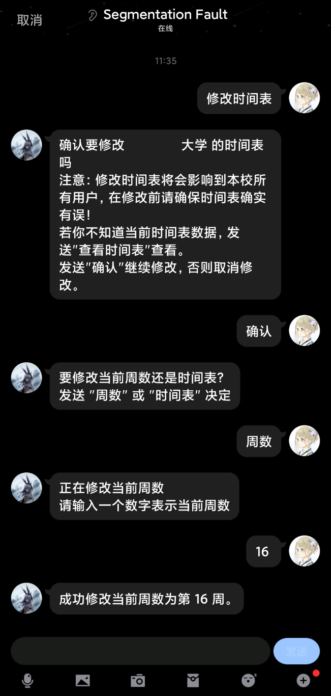

# SuperCourseTimetableBot

一个基于 [mirai](https://github.com/mamoe/mirai/) 和 [mirai-console](https://github.com/mamoe/mirai-console) 的 超级课程表 提醒 mirai-console 插件。

 [](https://www.codefactor.io/repository/github/konnyakucamp/supercoursetimetablebot)
## 特性



- #### Interactive Conversation Mode - 交互式聊天模式的用户接口

抛弃了传统的命令式交互，采用了更友好的交互式聊天模式。

- #### 允许用户更方便地修改时间表信息

可能超级课表上的作息时间表与学校不吻合，用户可以发送 **修改时间表** 来修改。

在 交互式聊天模式 的优势下，修改时间表的步骤变得非常容易。

- #### 允许用户自定义提醒时间

用户发送 **修改提前提醒时间** 即可通过步骤引导修改。

- #### 适配几乎所有使用超级课程表的高校



插件工作时，为每个正在使用的用户的高校分别计算当前周数和时间表，互不冲突。

- #### 数据库存储数据

使用 [MySQL](https://www.mysql.com/) 或 [MariaDB](https://mariadb.org/) 存储用户的数据，当用户数量较多时依然保持良好的数据读取性能。

## 使用

### 立即体验

添加 QQ好友：202746796，将会自动同意好友请求并发送提示。

### 部署

SuperCourseTimetableBot 是**基于 `mirai-core 2.x` 版本和 `mirai-console 2.x` 版本的插件，不兼容 1.x 版本**。

1. 运行一个新的或使用现有的 MySQL 或 MariaDB 数据库，在数据库中新建一个 database，名称随意。
2. 在 [Releases](https://github.com/KonnyakuCamp/SuperCourseTimetableBot/releases/) 中下载 `SCTimetableBot-x.x.mirai.jar` 将其放入 mirai-console 的 插件文件夹下。
3. 启动 mirai-console， 会有如下提示：

```
2020-12-19 12:28:20 E/SuperCourseTimetable: stageguard.sctimetable.database.InvalidDatabaseConfigException: Database password is not set in config file SG.SCTimeTableBotConfig.
stageguard.sctimetable.database.InvalidDatabaseConfigException: Database password is not set in config file SG.SCTimeTableBotConfig.
        at stageguard.sctimetable.database.Database.hikariDataSourceProvider(Database.kt:75)
        at stageguard.sctimetable.database.Database.connect(Database.kt:43)
        at stageguard.sctimetable.PluginMain.onEnable(PluginMain.kt:32)
        at ...
```

4. 停止运行 mirai-console，进入 SuperCourseTimetableBot 配置文件 `config/SuperCourseTimetable/SG.SCTimeTableBotConfig.yml`，按照如下提示修改配置。

```yaml
# 用于工作的BOT的QQ号，只有这个 Bot 上线后 SuperCourseTimetableBot 才会开始工作。
qq: 123456789
# 默认提前多长时间提醒(单位：分钟)。
# 此值会在用户第一次被添加进数据库时设置给这个用户。
# 注意：如果你修改了这个值，在修改之前已经被设置的用户和自己设定值的用户不会受到影响。
advancedTipTime: 15
database: 
  # MariaDB 或 MySQL 数据库的地址.
  address: localhost
  # 数据库登入用户.
  user: root
  # 数据库登入密码，删掉''后修改
  password: ''
  # 填入第一步你创建的数据库的名称。
  # 用户的数据都会被存储在这个数据库里。
  table: sctimetabledb
  # 最大连接数，非特殊情况不需要修改。
  maximumPoolSize: 10
```

5. 重新运行 mirai-console，登录在第四部配置中指定的账号，SuperCourseTimetableBot 会输出如下提示：

```
2020-12-19 12:39:07 I/SuperCourseTimetable: TimeProviderService: Job YearUpdater is executed. (currentYear -> 2020)
2020-12-19 12:39:07 I/SuperCourseTimetable: TimeProviderService: Job SemesterUpdater is executed. (currentSemester -> 1)
2020-12-19 12:39:07 I/SuperCourseTimetable: ScheduleListenerService: Notification distribution job has executed.
2020-12-19 12:39:07 I/SuperCourseTimetable: TimeProviderService: Job SchoolWeekPeriodUpdater is executed.
```

这时 SuperCourseTimetableBot 就已经成功工作了。

> 注意：请确保运行 mirai-console 宿主机的时区是 `Asia/Shanghai` 并已同步北京时间！

## 稳定性

SuperCourseTimetableBot 并未经过长期运行测试，对于其 `Quartz` 任务触发是否错误，我们暂时无法得知。

建议将 mirai-console 的日志等级调整为 `ALL`，以便捕获问题。

> 在调整日志等级为 `ALL` 后 HikariCP 和 Quartz 库在每10秒就输出一次日志：
>
> ```
> 2020-xx-xx xx:xx:Xx D/com.zaxxer.hikari.pool.HikariPool: HikariPool-1 - Pool stats (total=10, active=0, idle=10, waiting=0)
> 2020-xx-xx xx:xx:Xx D/com.zaxxer.hikari.pool.HikariPool: HikariPool-1 - Fill pool skipped, pool is at sufficient level.
> 2020-xx-xx xx:xx:Xx D/org.quartz.core.QuartzSchedulerThread: batch acquisition of 0 triggers
> ```
>
> 它的输出过于频繁，会遮盖住 `SuperCourseTimetableBot` 的输出，你可以在 console 的配置文件添加如下配置：
>
> ```yaml
> loggers:
>   org.quartz.core.QuartzSchedulerThread: NONE
>   com.zaxxer.hikari.pool.HikariPool: NONE
> ```
>
> 来禁用它们的输出。

如有任何问题，请立即新建一个 ISSUE 来反馈，我们非常需要知道是否有稳定性问题。

## 工作原理 & 源码解析

如果你想了解 SuperCourseTimetableBot 是如何工作的，请阅读 [SuperCourseTimetableBot 代码结构解析](source-analyze.md)。

## TODO("")

- [x] 手动修改时间表
- [x] 在时间表被修改时通知本校其他用户
- [ ] 支持手动添加课程(补课或永久调整的课程)
- [ ] 使用 `Mozilla Rhino` 通过动态 `JavaScript` 来适配不同的教务系统。

## 开发计划

SuperCourseTimetableBot 插件将会在 `1.0` 版本允许动态适配不同教务系统(详见上方 `TODO` 第四条)，完全重构 `RequestHandlerService` 和 `BotRouteEventService`，并实现 自定义文本/自定义语音/自定义图片 提醒。

## 贡献

欢迎任何~~使用者~~大佬们贡献这个项目，你可以通过**反馈 BUG**，**提出 Pull Request** 申请，~~或修改文档错别字~~来贡献这个项目。

> 如果你有贡献这个项目的想法，建议你先浏览一下上面的代码结构解析。

## 使用的开源库

- [mirai](https://github.com/mamoe/mirai/) - 高效率 QQ 机器人框架 / High-performance bot framework for Tencent QQ.
- [mirai-console](https://github.com/mamoe/mirai-console) - mirai 的高效率 QQ 机器人控制台.
- [Exposed](https://github.com/JetBrains/Exposed) - A Kotlin SQL Framework.
- [HikariCP](https://github.com/brettwooldridge/HikariCP) - 光 HikariCP・A solid, high-performance, JDBC connection pool at last.
- [Quartz](https://github.com/quartz-scheduler/quartz) - A richly featured, open source job scheduling library.
- [yamlkt](https://github.com/Him188/yamlkt) - Multiplatform YAML parser & serializer for kotlinx.serialization written in pure Kotlin.

## 许可证协议

```
SuperCourseTimetableBot
Copyright (C) 2020-2021 The KonnyakuCamp Team

This program is free software: you can redistribute it and/or modify
it under the terms of the GNU Affero General Public License as published
by the Free Software Foundation, either version 3 of the License, or
(at your option) any later version.

This program is distributed in the hope that it will be useful,
but WITHOUT ANY WARRANTY; without even the implied warranty of
MERCHANTABILITY or FITNESS FOR A PARTICULAR PURPOSE.  See the
GNU Affero General Public License for more details.

You should have received a copy of the GNU Affero General Public License
along with this program.  If not, see <https://www.gnu.org/licenses/>.
```
